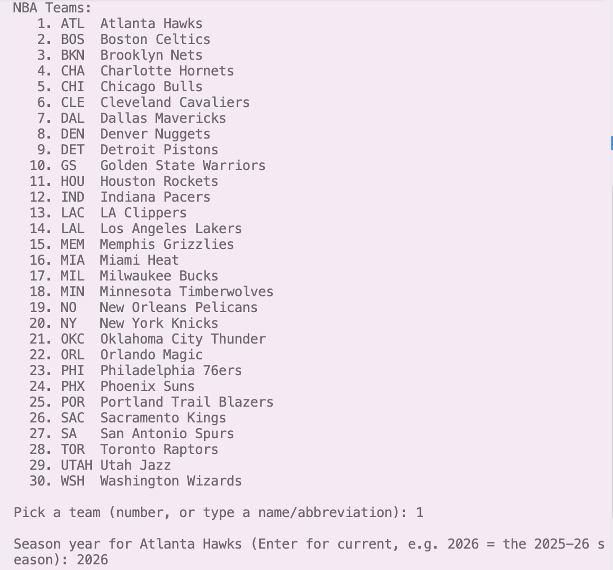
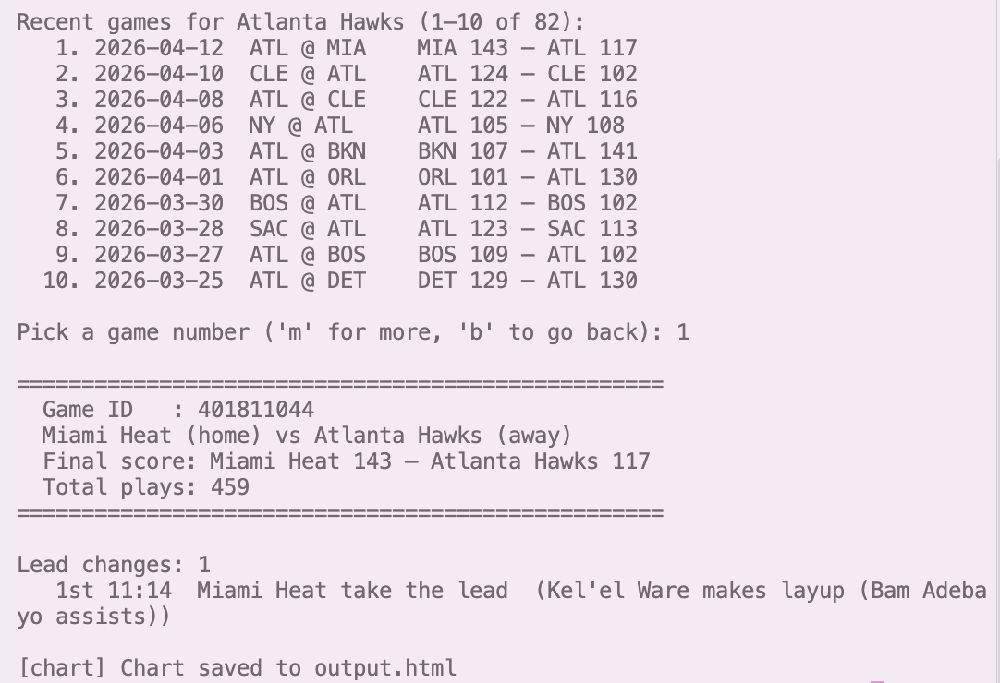
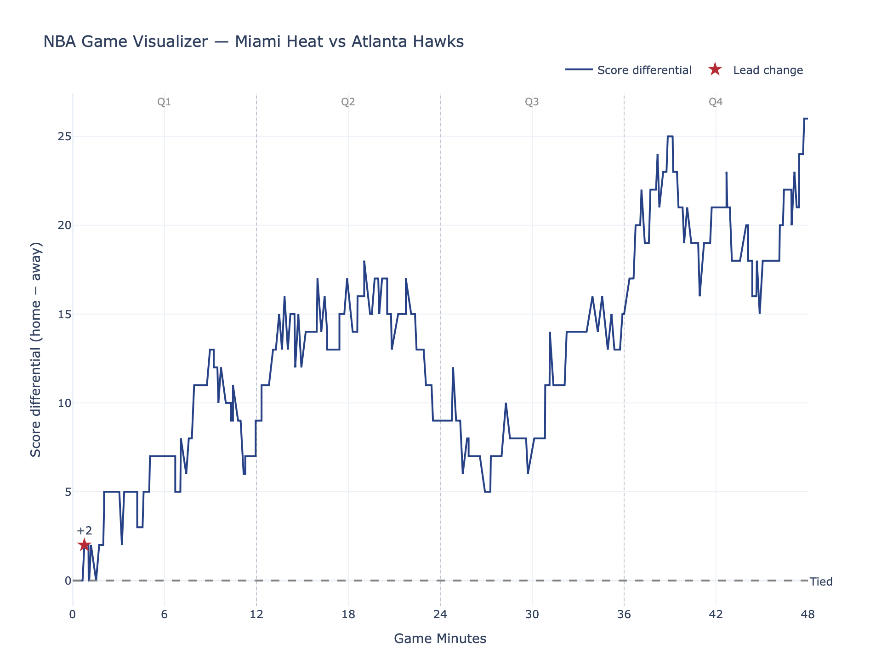
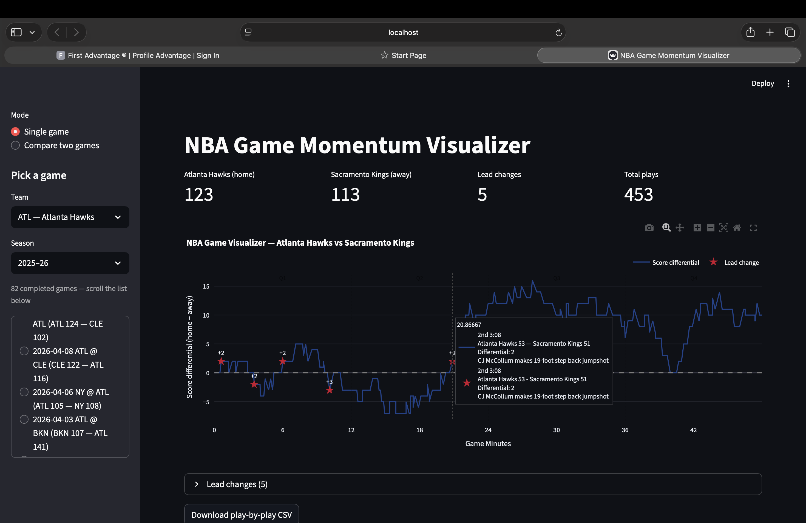
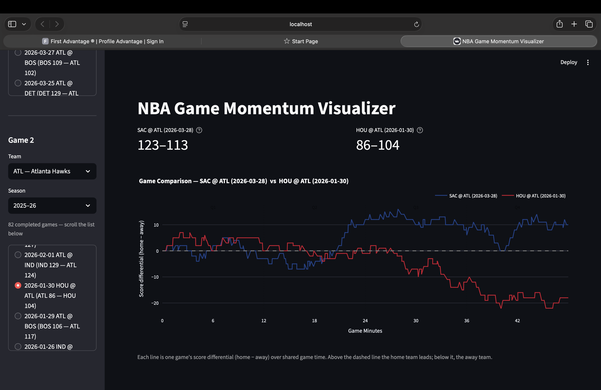
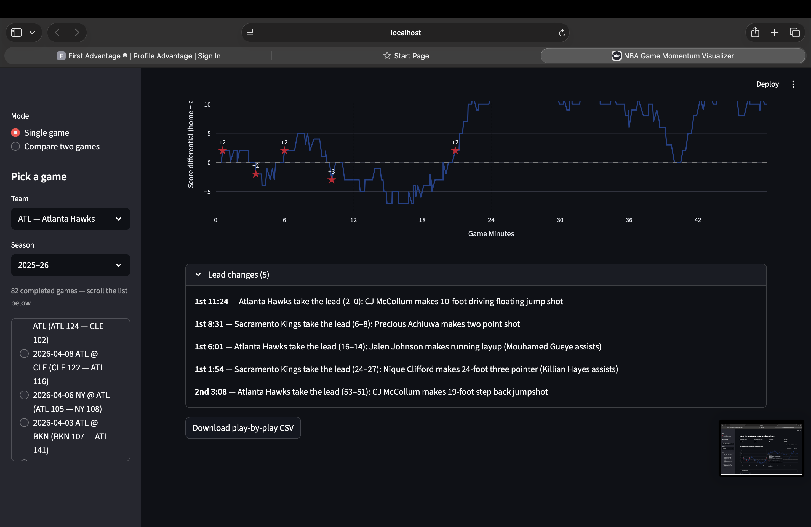

# NBA Game Visualizer

Thia project turns an NBA box score into a chart. Pick a team, pick a completed game, and the app charts the score differential play by play across game time, marking every lead change along the way. A comparison mode overlays two games on the same time axis so their momentum patterns can be read side by side.

Data comes from ESPN's public NBA endpoints. 

## Screenshots

| | |
|---|---|
| **Terminal team selection** |  |
| **Terminal game selection** |  |
| **Main.py output chart** |  |
| **Streamlit output chart** |  |
| **Lead changes star** |  |
| **Compare games** |  |
| **All lead changes** |  |


---

## What you need

| Requirement | Notes |
|---|---|
| Python 3.9 or newer | Developed and tested on Python 3.9 |
| An internet connection | Every run pulls live data from ESPN |
| A modern web browser | Streamlit and Plotly render in the browser |

No API key, login, database, or local data file is needed. The `data/` folder is created automatically the first time the command line version saves a CSV.

---

## Installation

1. **Get the code.** Clone the repository or download it as a ZIP and unpack it.

```bash
   git clone https://github.com/<your-username>/courtpulse.git
   cd courtpulse
```

2. **Install the dependencies.**

```bash
   pip install -r requirements.txt
```

## Running the app

### Web app (recommended)

```bash
streamlit run app.py
```

Streamlit prints a local URL, usually `http://localhost:8501`, and opens it in your default browser. Press `Ctrl+C` in the terminal to stop the server.

Running `python app.py` also works. The script detects that it was not launched through Streamlit and relaunches itself, so the Run button in an editor such as VS Code behaves the same way.

### Command line version

```bash
python main.py
```

This is the original text-only version. It asks the same questions in the terminal, prints a game summary, saves a CSV of the play by play, and opens the chart in your browser as `output.html`.

---

## Using the web app, step by step

### 1. Choose a mode

The sidebar opens on **Single game**. Switch to **Compare two games** at any time to load a second picker.

### 2. Pick a team

The **Team** dropdown lists all 30 NBA teams by abbreviation and full name. Typing in the dropdown filters the list.

### 3. Pick a season

The **Season** dropdown is labeled by the season span, so `2025-26` means the season that ended in 2026. **Current** asks ESPN for whatever season it considers active, which is useful during the offseason gap. The default selection is the most recent completed season.

### 4. Pick a game

Only completed games appear, newest first, each with its date, matchup, and final score. The list is scrollable inside its own panel. If a team and season combination returns nothing, a warning appears and you can choose a different season.

### 5. Read the chart

The main panel shows four metrics across the top: the home team's final score, the away team's final score, the number of lead changes, and the total number of plays.

Below the metrics is the momentum chart:

- **The line** is the score differential, calculated as home score minus away score, plotted against elapsed game minutes.
- **The dashed line at zero** is a tied game. Above it, the home team leads. Below it, the away team leads.
- **Red stars** mark lead changes, meaning the plays where the lead flipped from one team to the other.
- **Dotted vertical lines** separate quarters, with overtime periods added automatically when a game went long.

Hovering over the line shows the game clock, the score at that moment, the differential, and the description of the play.

### 6. Explore the details

Expand **Lead changes** below the chart for a written list of every flip, including the clock, the team that took the lead, the score, and the play that did it. A wire to wire win shows a short note instead.

Use **Download play-by-play CSV** to save the parsed data for the selected game.

### 7. Compare two games

In **Compare two games** mode the sidebar shows two full pickers, Game 1 and Game 2. The main panel shows both final scores and a single chart with both momentum lines overlaid, blue for the first game and red for the second. Picking the same game twice produces a prompt to change one of them.

Keep in mind that both lines are drawn as home minus away. If your team was at home in one game and on the road in the other, its line will appear above zero in the first case and below zero in the second. Hover on each line for its label.

---

## Using the command line version, step by step

1. Run `python main.py`.
2. A numbered list of all 30 teams appears. Enter the number, or type part of a team name or its abbreviation, for example `12`, `celtics`, or `bos`.
3. Enter a season year, or press Enter for the current season.
4. Ten recent completed games are listed. Enter a game number, `m` to see more games, or `b` to go back a page.
5. The summary prints the game ID, the matchup, the final score, the play count, and every lead change.
6. The play by play is saved to `data/play_by_play_<game_id>.csv`.
7. The chart is written to `output.html` and opened in your browser.

---

## Common messages and how to fix them

| What you see | What it means | What to do |
|---|---|---|
| `[ERROR] Could not reach ESPN API` | The request failed, usually a dropped connection or a timeout | Check your internet connection and run the app again |
| `[ERROR] Could not fetch team list` | Same cause, on the team list request | Retry. If it persists, ESPN may be temporarily unavailable |
| `[ERROR] ESPN returned no data for this game` | The game ID returned a response with no header section | Pick a different game. Preseason and some international games are inconsistently covered |
| `No play data found for this game` | The game finished but ESPN has no play by play attached, which happens with older seasons | Choose a more recent season. Play by play coverage is reliable from roughly 2015 onward |
| `No completed games found. Try another season year.` | The team and season combination has no finished games yet | Pick an earlier season, or use **Current** during the offseason |
| `No more games.` in the terminal | You paged past the end of the list | The list resets to the first page automatically |
| `You have picked the same game twice` | Both pickers in compare mode point at one game | Change Game 2 |
| `command not found: streamlit` | The virtual environment is not active, or the install did not finish | Activate `.venv` and run `pip install -r requirements.txt` again |
| A browser tab opens but stays blank | Streamlit is still starting, or a firewall is blocking the local port | Wait a few seconds and refresh `http://localhost:8501` |

---

## Limitations and caveats

These are known and expected in the current version:

- **Completed games only.** Live and scheduled games are filtered out. There is no in game refresh.
- **Momentum means score differential.** The chart tracks the raw point gap, not a weighted or rolling momentum metric. A long scoreless stretch shows up as a flat line, not as fading momentum.
- **Season list ends at 2026.** The dropdown is generated from a fixed range and will need to be extended for later seasons.
- **The comparison chart uses home minus away for both games.** Reading one team across two games requires checking which side it was on.
- **Older seasons thin out.** The further back you go, the more likely a game has no play by play data.
- **ESPN's endpoints are unofficial.** They are public and stable in practice, but they are not documented or guaranteed, and heavy repeated use may be throttled. The web app caches responses to keep request volume low.
- **No offline mode.** Every run needs a network connection, even for a game viewed earlier in the same session.

More detail on these, along with the bugs behind a few of them, is in the [developer's guide](doc/developer_guide.md#known-issues).

---

## Project structure

```
courtpulse/
├── main.py              # Data pipeline, chart builders, and the command line app
├── app.py               # Streamlit web app (run this one)
├── requirements.txt     # Python dependencies
├── README.md            # This file, the user's guide
├── data/                # CSV exports, created automatically by main.py
├── output.html          # Standalone chart written by main.py
└── doc/
    ├── developer_guide.md
    └── images/          # Screenshots used in the documentation
```

---

## Credits

Built for HCI 5840 at Iowa State University. Data provided by ESPN's public NBA API. Charts built with [Plotly](https://plotly.com/python/), interface built with [Streamlit](https://streamlit.io/), data handling with [pandas](https://pandas.pydata.org/).