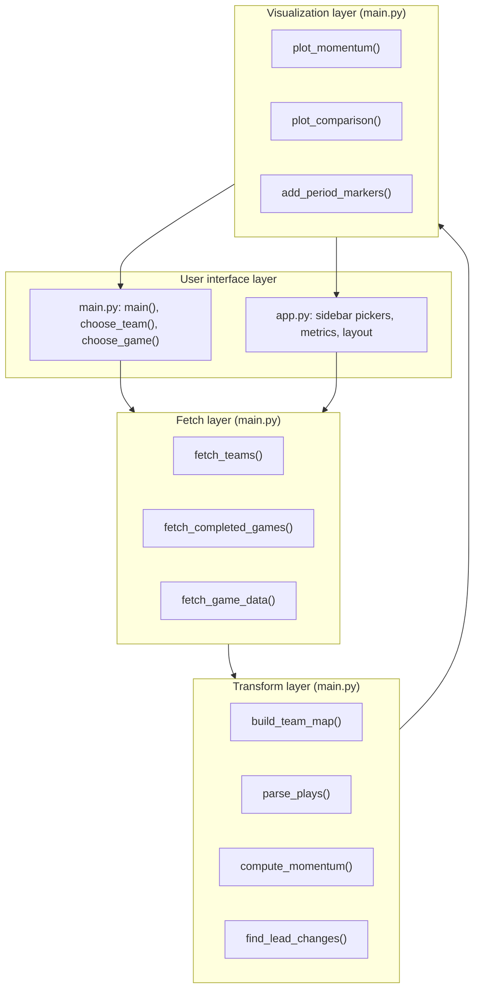

 # CourtPulse Developer's Guide

This document is written for the next developer on the project. It assumes you have already read the [user's guide], installed the project, and run it at least once.

---

## Table of contents

1. [Overview](#overview)
2. [Implemented specification](#implemented-specification)
3. [Setup and deployment notes for developers](#setup-and-deployment-notes-for-developers)
4. [Architecture](#architecture)
5. [Code walkthrough](#code-walkthrough)
6. [The play by play DataFrame](#the-play-by-play-dataframe)
7. [Known issues](#known-issues)
8. [Performance notes](#performance-notes)
9. [Future work](#future-work)
10. [Ongoing development](#ongoing-development)

---

## Overview

NBA Game Visualizer fetches play by play data for a completed NBA game from ESPN's public API, converts it into a pandas DataFrame indexed by elapsed game time, and plots the score differential as an interactive Plotly chart. Lead changes are detected and marked. A second mode overlays two games on one shared time axis.

The project has two entry points that share one pipeline:

- `main.py` is the original command line application and the home of all data and chart logic.
- `app.py` is a Streamlit front end that imports from `main.py` and adds only a UI layer. No logic is duplicated between them.

Anything that transforms data or builds a figure belongs in `main.py` so both entry points get it. `main.py` runs nothing on import because `main()` sits behind an `if __name__ == "__main__"` guard.

---

## Implemented specification

What the original project specification proposed, and where each item landed:

| Feature | Status | Notes |
|---|---|---|
| Fetch NBA play by play from a live source | Implemented | ESPN `summary` endpoint, keyless |
| Score differential chart over the course of a game | Implemented | `plot_momentum` |
| X axis in readable game time | Implemented | Elapsed minutes with quarter and overtime dividers, and clock labels on hover |
| Interactive team selection | Implemented | Number, name, or abbreviation in the CLI, dropdown in the web app |
| Game selection from a list of completed games | Implemented | Paginated in the CLI, scrollable radio list in the web app |
| Season selection | Implemented | Schedule endpoint accepts a `season` parameter |
| Highlight the biggest momentum swings | Replaced | The original top five swings were dropped in favor of lead changes, which read more clearly. `find_lead_changes` replaced the earlier top swing logic |
| Two game comparison overlay | Implemented | `plot_comparison` plus the compare mode toggle in `app.py` |
| CSV export of parsed plays | Implemented | Written to disk by the CLI, offered as a download button in the web app |
| Web front end | Implemented | Streamlit, added after the CLI was working |
| Player level or possession level analytics | Not implemented | Out of scope for this version, see [Future work](#future-work) |
| Live or in progress games | Not implemented | Completed games are the only supported case |

---

## Setup and deployment notes for developers

Beyond the user install, a few things are worth knowing:

- **Python version.** Development was done on Python 3.9.
- **`data/` and `output.html` are build artifacts.** They are regenerated on every CLI run and are excluded in `.gitignore`.
- **Streamlit caching is on.** `@st.cache_data` decorates the three fetch wrappers in `app.py` with time to live values of 3600, 600, and 3600 seconds. While debugging the fetch layer, either clear the cache from the Streamlit menu or temporarily comment the decorators out. Otherwise you will be reading stale responses and blaming your code.
- **Streamlit reruns the entire script top to bottom on every widget interaction.** Any expensive call that is not cached will run again on every click. Module level state does not survive a rerun.
- **Deployment.** The app has no server side state and no writes outside the working directory, so Streamlit Community Cloud or any container that runs `streamlit run app.py` will work. Outbound HTTPS access to `site.api.espn.com` is the only network requirement.

---

## Architecture

There are no classes in the project. The design is a set of small pure-ish functions with a single mutable object, the DataFrame, passed between them. That was a deliberate choice for a project this size, and it is the main reason `app.py` was able to reuse the whole pipeline without refactoring.

### Module map

| Module | Contains |
|---|---|
| `main.py` | Everything: constants, three fetch functions, four time and parsing helpers, two transform functions, three plotting functions, the CSV writer, two CLI prompt functions, and `main()` |
| `app.py` | Streamlit page config, three cached fetch wrappers, one reusable picker function, and the two render branches |

---

## Code walkthrough

### Web app flow (`app.py`)

The user opens the app, picks a team, season, and game, and reads a chart. Here is what runs at each step.

**1. Startup.** `app.py` first checks whether it is running inside a Streamlit runtime. If not, it rewrites `sys.argv` and hands off to `stcli.main()`, which is what makes `python app.py` behave like `streamlit run app.py`. This block sits above the imports from `main.py` on purpose, so the relaunch happens before any real work.

**2. Imports.** The nine pipeline functions are imported by name from `main.py`. If you add a pipeline function, add it here too.

**3. Cached wrappers.** `get_teams()`, `get_games(team_id, season)`, and `get_game_df(game_id)` wrap the fetch functions with `@st.cache_data`. `get_game_df` is the important one: it runs the entire fetch, parse, and compute chain and returns `(df, home_name, away_name)`. Home and away names are resolved here by walking the `competitors` list in the response header and checking each entry's `homeAway` field.

**4. `render_game_picker(slot)`.** One function draws a complete team, season, and game picker. The `slot` argument is appended to every widget key (`team_1`, `season_2`, and so on) so two independent pickers can coexist in compare mode without colliding in session state. This is the pattern to follow if a third picker is ever needed. It returns the selected game dict, or `None` when the season has no completed games.

**5. Sidebar.** The mode radio decides whether one picker or two are drawn. `st.stop()` halts the script when a picker returns `None`, which prevents the main panel from rendering against missing data.

**6. Main panel, single game mode.** Calls `get_game_df`, guards against an empty frame, computes final scores from the last row, calls `find_lead_changes`, draws four `st.metric` cards, calls `plot_momentum`, and renders the figure with `st.plotly_chart`. The lead change expander iterates the returned rows. The download button serializes the DataFrame to CSV in memory rather than writing to disk.

**7. Main panel, compare mode.** Guards against the same game being chosen twice, loads both frames, builds a label for each from the game name and date, and passes a list of `{"df": ..., "label": ...}` dicts to `plot_comparison`. That list shape is the contract for the comparison chart, and it is what a future three game overlay would extend.

### Command line flow (`main.py`)

`main()` runs the same pipeline in a fixed sequence:

`choose_team()` → `choose_game(team)` → `fetch_game_data(game_id)` → `build_team_map(header)` → `parse_plays(plays, team_map)` → `pd.DataFrame(rows)` → `compute_momentum(df)` → `find_lead_changes(df)` → printed summary → `save_csv()` → `plot_momentum()` → `fig.write_html()` → `fig.show()`.

`choose_team()` prints the full team list and accepts either an index or a substring match on name or abbreviation, reprompting on an ambiguous match. `choose_game()` pages through completed games ten at a time with `m` and `b` controls.

### Function reference

| Function | Module | Purpose |
|---|---|---|
| `fetch_teams()` | `main.py` | GETs the teams endpoint and returns a list of `{id, name, abbr}` sorted by name |
| `fetch_completed_games(team_id, season)` | `main.py` | GETs a team's schedule, filters to `status.type.completed`, returns `{id, date, name, score}` newest first. Handles the schedule endpoint returning score as a dict while the summary endpoint returns a string |
| `fetch_game_data(game_id)` | `main.py` | GETs the game summary and validates that a `header` key exists |
| `build_team_map(header)` | `main.py` | Maps team ID to display name so plays can be attributed |
| `clock_to_seconds(clock_str)` | `main.py` | Parses `MM:SS` and bare decimal seconds such as `41.6` |
| `elapsed_time(period, clock_str)` | `main.py` | Converts period plus clock into seconds elapsed since tipoff. Regulation periods are 720 seconds, overtime periods are 300 |
| `period_label(period)` | `main.py` | Produces `1st` through `4th` and `OT1`, `OT2`, and so on |
| `parse_plays(plays, team_map)` | `main.py` | Flattens the nested play JSON into a list of row dicts, computing `elapsedTime`, `periodLabel`, and `timeLabel` along the way |
| `compute_momentum(df)` | `main.py` | Drops rows missing scores, coerces scores to numeric, and adds `momentum`, `swing`, and `gameMinutes` |
| `find_lead_changes(df)` | `main.py` | Returns the rows where the sign of `momentum` flipped, using a forward filled shifted sign comparison so ties do not register as changes |
| `add_period_markers(fig, max_minutes)` | `main.py` | Draws quarter dividers at 12, 24, and 36 minutes and extends into overtime in five minute steps |
| `plot_momentum(df, lead_changes, home_name, away_name)` | `main.py` | Builds the single game figure: momentum line, tie line, star markers, period markers, layout |
| `plot_comparison(games)` | `main.py` | Builds the two game overlay from a list of `{df, label}` dicts |
| `save_csv(df, path)` | `main.py` | Creates the parent directory and writes the CSV |

---

## The play by play DataFrame

Every downstream function depends on this shape. Changing it is the single most breaking change available in this codebase.

| Column | Type | Created in | Meaning |
|---|---|---|---|
| `period` | int or None | `parse_plays` | Period number, 1 through 4 for regulation, higher for overtime |
| `clock` | str | `parse_plays` | Display clock at the play, for example `7:42` |
| `team` | str | `parse_plays` | Resolved team name, or `Unknown` when unattributed |
| `type` | str | `parse_plays` | ESPN play type text |
| `text` | str | `parse_plays` | Play description, used in hover text |
| `scoreValue` | int | `parse_plays` | Points on the play |
| `homeScore` | float | `compute_momentum` | Running home score |
| `awayScore` | float | `compute_momentum` | Running away score |
| `scoringPlay` | bool | `parse_plays` | Flag from ESPN, currently unused downstream |
| `periodLabel` | str | `parse_plays` | `1st`, `OT1`, and so on |
| `elapsedTime` | float | `parse_plays` | Seconds since tipoff |
| `timeLabel` | str | `parse_plays` | `periodLabel` plus clock, shown on hover |
| `momentum` | float | `compute_momentum` | `homeScore - awayScore` |
| `swing` | float | `compute_momentum` | Absolute change in `momentum` from the previous row. `NaN` in row 0 |
| `gameMinutes` | float | `compute_momentum` | `elapsedTime / 60`, the x axis |

---

## Known issues

Every issue below is also flagged at the relevant line in the source with a `# TODO` or `# GOTCHA` comment, so a developer reading the code hits the same warnings without needing this document open.

### Major

**Season dropdown is hard coded.** `render_game_picker` builds the season list from `range(2026, 2002, -1)`. Once the 2026-27 season exists, it will be unreachable in the web app. The **Current** option is the only workaround. Fix by deriving the upper bound from today's date, roughly `year + 1` after September, or by reading the active season from an ESPN response.

**Comparison mode is home minus away for both lines.** A user comparing one team across two games sees its line flip sides when it changed venue. The caption explains this, but the honest fix is to let the user pick a reference team and negate the differential when that team was away. That would mean passing an orientation flag into `plot_comparison`.

**ESPN's API is unofficial.** No contract, no versioning, no notice of change. If field names move, `parse_plays` and `build_team_map` are where breakage will surface first. Both use `.get()` with defaults throughout, so a rename produces empty columns rather than an exception, which is quieter and therefore worse. Consider asserting on a few required fields after parsing.

### Minor

**The star labels are mislabeled.** The number on each star is the `swing` value, meaning the point change on that single play, not the magnitude of the lead change. It reads as though it is measuring something larger than it is. Either relabel it or drop the text.

**`numpy` is imported inside `find_lead_changes`.** It should be a module level import with the others. Harmless, but it hides a real dependency from anyone reading the import block.

**`hovermode="x unified"` doubles up on star rows.** Where a lead change marker sits on the line, the unified hover box shows both traces. Cosmetic.

**Indentation in `plot_momentum` is misleading.** The `add_period_markers` call reads as though it belongs to the `if not lead_changes.empty:` block above it. It does not, and the behavior is correct, but it is easy to misread. A `# NOTE` marks this in the source. Re-indent for clarity.

**`scoringPlay` and `type` are parsed but never used.** Either build something on them or drop them from `parse_plays`.

---

## Performance notes

Nothing here is really slow at the current scale. A single game is roughly 450 plays, which is trivial for pandas. The costs that do exist are all network costs:

- **The CLI refetches everything on every run,** including the 30 team list that never changes within a session. The web app avoids this with `@st.cache_data`, but the cache is per session and per process, so a restart pays the cost again. A small on disk cache keyed by game ID would eliminate repeat fetches entirely, and play by play for a completed game is immutable, so it can be cached forever.
- **Compare mode issues two full summary fetches,** sequentially. With a real slowdown at ESPN this is visibly two waits rather than one. `concurrent.futures.ThreadPoolExecutor` would overlap them.
- **`fetch_completed_games` pulls a full season schedule** to display ten rows. That is the endpoint's smallest available unit, so there is nothing to trim without caching.
- **A team's full season overlay,** if that is ever built, would mean 82 sequential fetches. At that scale, batching and an on disk cache stop being optional.

---

## Future work

Roughly in order of value:

1. **Derive the season list dynamically** and remove the hard coded 2026 ceiling. 
2. **A reference team toggle in compare mode** so both lines can be oriented around one team.
3. **Annotate significant events** such as timeouts, ejections, and the largest scoring run, pulled from the `type` field already being parsed.
4. **Player level filtering,** for example the differential while a given player was on the floor. ESPN's summary response carries enough substitution data to attempt it.
5. **Multi game overlay.** `plot_comparison` already takes a list, so the chart function mostly supports this. The UI and the color list are the work.

---

## Ongoing development

The project is a course deliverable and is not expected to run in production. If it is picked up anyway, three things would matter most:

- **Dependencies.** `requirements.txt` currently uses minimum version floors. Pin exact versions before anything depends on this running unattended. Plotly and Streamlit both make breaking changes across major versions.
- **Add tests against a saved fixture.** Save one full ESPN summary response as JSON in `tests/fixtures/` and test `parse_plays`, `compute_momentum`, and `find_lead_changes` against it. Those three functions carry all the logic worth protecting, and they are pure given a fixture, so the tests need no network. A regulation game and an overtime game as fixtures would cover the `elapsed_time` branch that has already produced one bug.